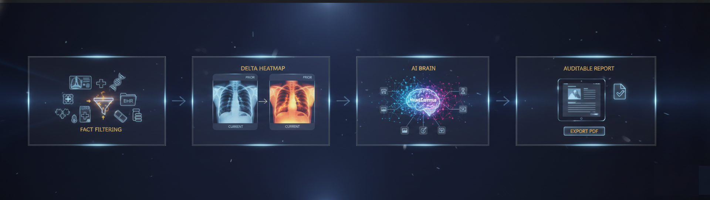
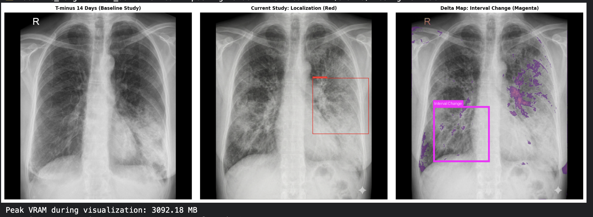
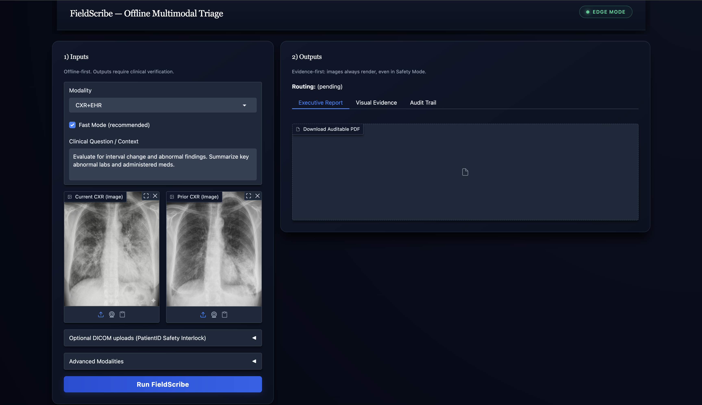

# Offline Multimodal Clinical Triage Copilot (MedGemma 1.5)

**FieldScribe** is an **offline‑first, evidence‑anchored triage copilot** that localizes chest X‑ray findings, detects interval change, compresses FHIR EHR context into auditable facts, and generates a clinician‑readable **triage report + tamper‑evident PDF** — designed to run on a **single T4‑class GPU** without cloud dependencies once weights/assets are present.

> **Status:** research/demo prototype (Kaggle “run‑all” notebook) — **not a medical device**.

---

## Why this exists (Problem statement)

In many clinical environments, the bottleneck isn’t “can AI answer medical questions?” — it’s **last‑mile triage under severe operational constraints**:

- **Intermittent connectivity:** rural clinics, mobile units, disaster response, and overcrowded EDs can’t rely on cloud uptime.  
- **Strict data sovereignty:** PHI often legally cannot leave the site or cross borders.  
- **Fragmented evidence:** images, EHR facts, and priors exist — but clinicians must manually fuse them under intense time pressure.

**Chest X‑ray (CXR) interval change review** illustrates the gap: a clinician must  
(1) identify what changed since the prior scan, (2) localize findings, (3) reconcile EHR context (vitals/labs/meds), and (4) write an auditable triage note.

FieldScribe makes this workflow **fast, offline, and evidence‑first** — enabled by **open‑weight multimodal clinical models (MedGemma 1.5)**.

---

## At a glance (4‑step pipeline)

  
**Figure 1 — FieldScribe’s multimodal workflow:** raw inputs → explicit evidence → auditable report.

### 1) Data ingestion + Fact Filtering (Processing the Inputs)
- Accepts **current + prior CXR** (image or DICOM) + offline **FHIR‑shaped EHR bundle**  
- “**Fact Filter**” compresses dense EHR to **query‑relevant bullet facts** (no invention)  
- Outcome: the model is forced to reason from **ground truth evidence**, not vague summaries

  
**Figure 2 — Fact Filter:** compresses dense EHR to keep the model grounded and reduce hallucination risk.

### 2) Visual comparison + Δ heatmap (Showing the Issues)
- Computes **interval‑change heatmap** between prior and current  
- Produces a clinician‑inspectable evidence panel **before the LLM generates anything**

  
**Figure 3 — Visual Evidence Panel:** baseline, localization, and interval change (Δ) map.

### 3) MedGemma multimodal synthesis (The AI Brain)
- Uses **MedGemma 1.5 4B IT** to synthesize:
  - **longitudinal CXR review**
  - **anatomical localization / grounding**
  - **EHR‑informed summary**
- Runs in **deterministic mode** for reproducibility and supports optional **glass‑box trace** for audit/debug.

### 4) Triage report + PDF export (The Final Output)
- Produces an executive triage note (findings, interval changes, EHR facts, next steps)  
- Exports a **Unicode‑safe**, tamper‑evident **PDF** + structured **audit packet**

📄 Example output: [`assets/Auditable_Clinical_Summary_Report.pdf`](assets/Auditable_Clinical_Summary_Report.pdf)

---

## Demo UI (offline dashboard)

  
**Figure 4 — Edge dashboard UI:** inputs on the left; outputs/evidence/audit trail on the right.

---

## Safety guardrails (SaMD‑aware posture)

FieldScribe is designed as **assistive software** with an **evidence‑first UX**:

- **Human‑in‑the‑loop:** non‑diagnostic; requires clinician verification  
- **Evidence-first presentation:** images + Δ heatmap + extracted facts displayed with narrative output  
- **Audit artifacts:** JSON audit packet + PDF paper trail (trace/prompt metadata + disclaimers)  
- **DICOM safety routing interlock:** prevents patient mismatches entering synthesis

  
**Figure 5 — DICOM safety routing:** fail‑safe fallback when patient identity is inconsistent.

---

## Impact (why this matters)

If validated and deployed, FieldScribe’s operational impact is immediate:

- **Time saved per complex triage case:** ~**10–14 minutes**  
  (manual EHR review + prior comparison + note drafting → seconds/minutes evidence-first workflow)
- **Capacity reclaimed (example):**  
  If a site reviews **40 cases/day**, saving **10 minutes/case** yields:

  **40 × 10 = 400 minutes/day ≈ 6.7 hours/day** returned to direct care

- **Access + privacy:** enables specialist‑level assistance in bandwidth‑limited or sovereignty‑restricted settings where cloud tools are legally or infrastructurally prohibited.

---

## Why MedGemma 1.5 (HAI‑DEF) is the right fit

FieldScribe uses **MedGemma 1.5 4B IT** because it aligns with real clinical multimodal needs:

- **Longitudinal imaging review** (current vs prior CXR)  
- **Grounding/localization** (“show me where” evidence, not just text)  
- **Compute‑efficient open weights** (practical for on‑prem / edge inference)

This is **not** a generic chatbot wrapper — MedGemma is used as a **strict multimodal synthesizer anchored to explicit evidence artifacts**: fact bullets, localization boxes, and Δ heatmaps.

---

## Feasibility (hardware survival + reproducibility)

Designed for “run‑all” stability in Kaggle-style environments:

- Target: **single NVIDIA T4‑class GPU**
- **Fast Mode** reduces latency (shorter context + conservative token budget) while preserving evidence outputs
- **Warmup after load** reduces first‑click latency spikes
- **Offline-first defaults**: local sample assets + resilient fallbacks
- **Instrumentation** logs **latency, peak VRAM, and output tokens** (see notebook “Feasibility instrumentation” section)

---

## Disclaimer

FieldScribe is a demonstration prototype. It is **not** approved for clinical diagnosis, triage, or treatment decisions. Outputs must be reviewed and validated by qualified clinicians before any real‑world use.

